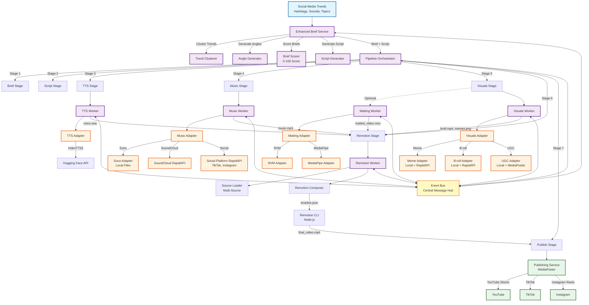
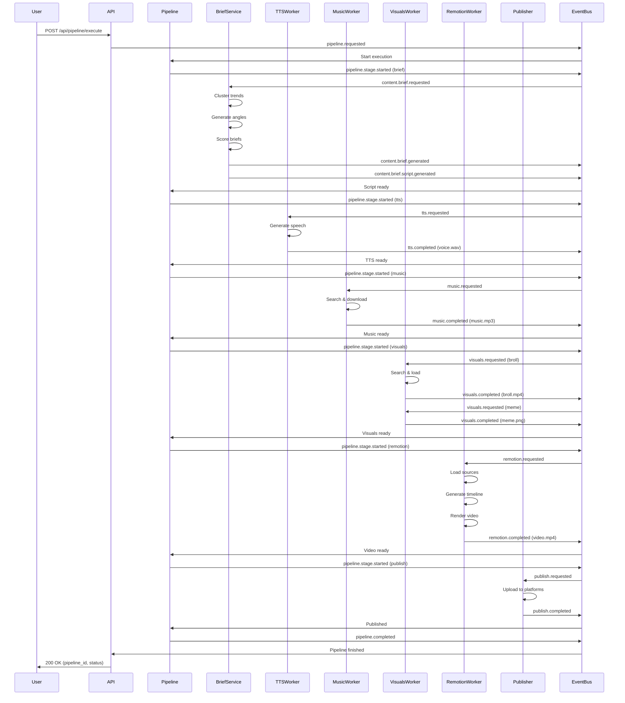
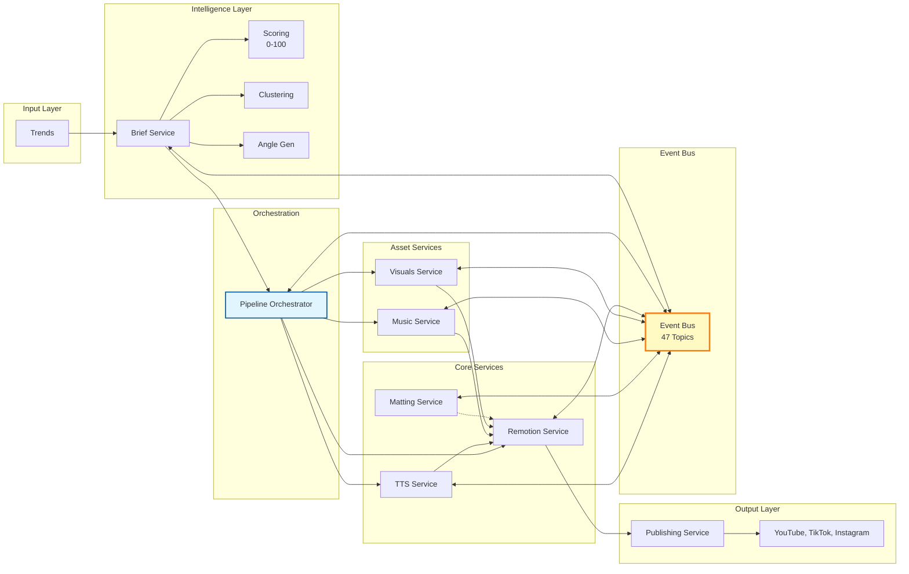
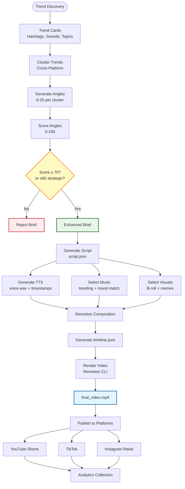
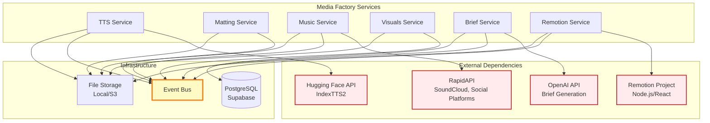
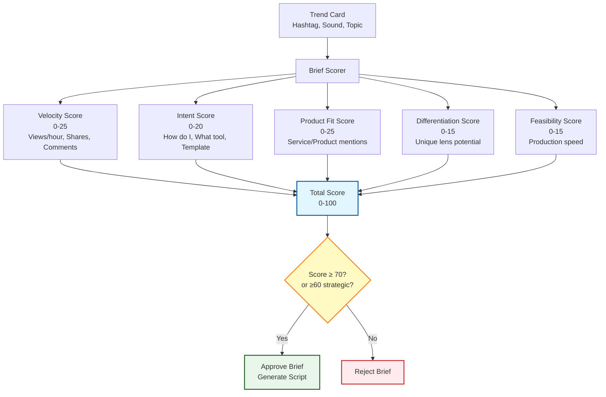

# Media Factory - System Architecture Diagram

This document contains Mermaid diagrams showing the complete Media Factory system architecture.

---

## Complete System Architecture



---

## Event Flow Diagram



---

## Service Interaction Diagram



---

## Adapter Pattern Diagram

```mermaid
graph TB
    subgraph "TTS Service"
        TTSWorker[TTS Worker]
        TTSBase[TTS Adapter Base]
        IndexTTS2[IndexTTS2 Adapter]
        FutureTTS[Future: ElevenLabs, Coqui]
    end
    
    subgraph "Matting Service"
        MattingWorker[Matting Worker]
        MattingBase[Matting Adapter Base]
        RVM[RVM Adapter]
        MediaPipe[MediaPipe Adapter]
        FutureMat[Future: SAM 2, BackgroundMattingV2]
    end
    
    subgraph "Music Service"
        MusicWorker[Music Worker]
        MusicBase[Music Adapter Base]
        Suno[Suno Adapter]
        SoundCloud[SoundCloud Adapter]
        Social[Social Platform Adapter]
    end
    
    subgraph "Visuals Service"
        VisualsWorker[Visuals Worker]
        VisualsBase[Visuals Adapter Base]
        Meme[Meme Adapter]
        Broll[B-roll Adapter]
        UGC[UGC Adapter]
    end
    
    TTSWorker --> TTSBase
    TTSBase --> IndexTTS2
    TTSBase -.-> FutureTTS
    
    MattingWorker --> MattingBase
    MattingBase --> RVM
    MattingBase --> MediaPipe
    MattingBase -.-> FutureMat
    
    MusicWorker --> MusicBase
    MusicBase --> Suno
    MusicBase --> SoundCloud
    MusicBase --> Social
    
    VisualsWorker --> VisualsBase
    VisualsBase --> Meme
    VisualsBase --> Broll
    VisualsBase --> UGC
    
    style TTSBase fill:#fff3e0,stroke:#e65100,stroke-width:2px
    style MattingBase fill:#fff3e0,stroke:#e65100,stroke-width:2px
    style MusicBase fill:#fff3e0,stroke:#e65100,stroke-width:2px
    style VisualsBase fill:#fff3e0,stroke:#e65100,stroke-width:2px
```



---

## Data Flow Diagram



---

## Component Dependencies



---

## Scoring System Flow



---

## API Endpoint Structure

```mermaid
graph TB
    API[FastAPI Application<br/>/api]
    
    API --> TTSAPI[TTS Endpoints<br/>/api/tts]
    API --> MattingAPI[Matting Endpoints<br/>/api/matting]
    API --> RemotionAPI[Remotion Endpoints<br/>/api/remotion]
    API --> PipelineAPI[Pipeline Endpoints<br/>/api/pipeline]
    API --> MusicAPI[Music Endpoints<br/>/api/music]
    API --> VisualsAPI[Visuals Endpoints<br/>/api/visuals]
    
    TTSAPI --> TTSGen[POST /generate]
    TTSAPI --> TTSStatus[GET /status/{job_id}]
    TTSAPI --> TTSModels[GET /models]
    
    MattingAPI --> MattingProcess[POST /process]
    MattingAPI --> MattingStatus[GET /status/{job_id}]
    MattingAPI --> MattingModels[GET /models]
    
    RemotionAPI --> RemotionRender[POST /render]
    RemotionAPI --> RemotionStatus[GET /status/{job_id}]
    RemotionAPI --> RemotionSources[GET /source-types]
    
    PipelineAPI --> PipelineExec[POST /execute]
    PipelineAPI --> PipelineStatus[GET /status/{pipeline_id}]
    
    MusicAPI --> MusicRequest[POST /request]
    MusicAPI --> MusicSources[GET /sources]
    
    VisualsAPI --> VisualsRequest[POST /request]
    VisualsAPI --> VisualsTypes[GET /types]
    VisualsAPI --> VisualsSources[GET /sources]
    
    style API fill:#e1f5ff,stroke:#01579b,stroke-width:3px
```

---

*These diagrams show the complete Media Factory system architecture, data flow, and component interactions.*

